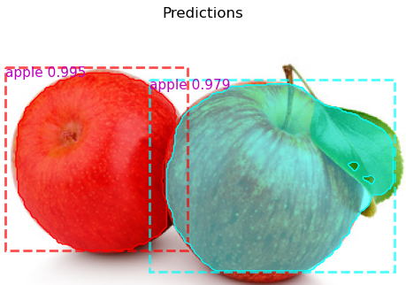

# Fruits and Mask R-CNN
A group project for a Data Mining course by Nghia Dao, Justin Zeh, and Steven Nguyen for a topic in supervised learning through classification.
## Overview
This application of Mask R-CNN, a convolutional neural network (CNN) presented by [[1]](#1), modifies and builds upon the samples provided by the Python implementation [[2]](#2) of it. We annotated an existing dataset of 300 images of fruits [[3]](#3) with a focus on apples, oranges, and bananas. By training a model with Mask R-CNN (using pretrained COCO weights), this enables the model to apply instance segmentation, where it classifies the label and the associated of pixels of each unique fruit (the mask) to be an apple, orange, or banana. In addition, the CNN also outputs the fruits' bounding box and confidence score for its associated label.

Since the Python implementation of Mask R-CNN by [[2]](#2) does not support Tensorflow 2.0, we utilize its updated version by [[4]](#4).

## Dataset Annotation
- Since the dataset of fruits was originally designed for object detection with a bounding box, we manually annotated each fruit with a polygon outline using [makesense.ai](https://www.makesense.ai/). This dataset was split into 240 images for training and 60 images for validation/testing.
<p align="center">
    
    <br>Polygon outline of an orange with its associated label<br>
    <br>
    <br>The orange's corresponding cartesian coordinates<br>
    <br>
    <br>The orange's corresponding mask
</p>

## Results
- Upon providing a target image as a JPG to predict on, using the latest training weights after ten epochs, the model attempts to classify the label of each fruit it was trained on while also classifying their corresponding masks.
<p align="center">
    
    <br>Predictions on two apples<br>
    <br>
    <br>Predictions on four apples and a banana<br>
    <br>
    <br>Predictions on three oranges<br>
</p>

## Workflow
<p align="center">
    
</p>

## Environment and Requirements
- Windows 10 with Anaconda and the Spyder IDE was used.
  - To copy the exact environment that was used, copy the following into Anaconda Prompt:<br>
    ```conda create --name tf_2_3_0 --file requirements.txt```
- Most notable version requirements:
    - Python 3.8.15
    - Tensorflow: 2.3.0
## Usage
- To train the model on the fruits dataset (change the directory as needed):<br>
`runfile('directory/to/fruits_MaskRCNN/train.py')`  
- To infer/predict upon a target image (change the directory and argument as needed):<br>
`runfile('directory/to/fruits_MaskRCNN/inference.py', args='fruits2.jpg')` 
* Note(1): To keep the repository size small, the fruits training weights after 10 epochs and the pretrained COCO weights are not included. The latter will be automatically downloaded through mrcnn/utils.py upon the first attempt to train the model.
* Note(2): If an error like "operands could not be broadcast together with shapes (1024,1024,4) (3,)" occurs during inferencing and the target image is in PNG, you may need to convert it into JPG.

## References
<a id="1">[1]</a> 
K. He, G. Gkioxari, P. Doll, and R. B. Girshick, "Mask R-CNN," in *arXiv*, 2017. doi:10.48550/arXiv.1703.06870 [Online]. Available: https://arxiv.org/abs/1703.06870<br><br>
<a id="2">[2]</a> 
W. Abdulla, "Mask R-CNN for object detection and instance segmentation on Keras and TensorFlow," in *Github repository*, 2017. Available: 
https://github.com/matterport/Mask_RCNN<br><br>
<a id="3">[3]</a>
M. Buyukkinac, "Fruits Images for Object Detection," in *Kaggle*, 2018. Available: https://www.kaggle.com/datasets/mbkinaci/fruit-images-for-object-detection<br><br>
<a id="4">[4]</a> 
A, Kelly. "Mask_RCNN," in *Github repository*, 2020. Available: https://github.com/akTwelve/Mask_RCNN<br>